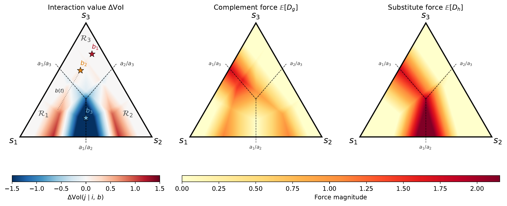

# Residual Expertise Is Not Decision Value



When does residual human predictive information actually change the action deployed by an AI system?

We show that residual expertise has decision value only when the human-updated posterior crosses a reward-induced decision boundary.
The paper introduces boundary regret as a deployment estimand for human-AI complementarity and validates it with Lean-formalized finite-action decision theory, synthetic estimator checks, and CheXpert experiments. CIFAR-10H is included as a theory-confirming negative control: on highly accurate classifiers whose softmax probabilities rarely straddle a reward facet, the dissociation signal collapses to near-zero, exactly as the theory predicts.

## Paper

[NeurIPS 2026 camera-ready paper (PDF)](https://github.com/nidhishs/residual-expertise-is-not-decision-value/blob/main/paper/residual-expertise-is-not-decision-value.pdf) · [LaTeX source](paper/)

To rebuild the PDF with [Tectonic](https://tectonic-typesetting.github.io/):

```bash
cd paper
tectonic main.tex
mv main.pdf residual-expertise-is-not-decision-value.pdf
```

## Formal proofs

Lean 4 mechanized proofs for the boundary-regret claims are in `lean/`.

## Code & reproduction

Experiment code and CLI entry points live in `source/`. See [`source/data/README.md`](source/data/README.md) for the data pipeline (CheXpert + CIFAR-10H) and [`source/experiments/README.md`](source/experiments/README.md) for experiment commands and generated results. `source/experiments/run_experiments.sh` runs the full CheXpert pipeline end-to-end.

## Earlier paper

[All Substitution Is Local](https://arxiv.org/abs/2604.01443) and its original source and proofs are preserved on [`archive/all-substitution-is-local`](https://github.com/nidhishs/residual-expertise-is-not-decision-value/tree/archive/all-substitution-is-local).
